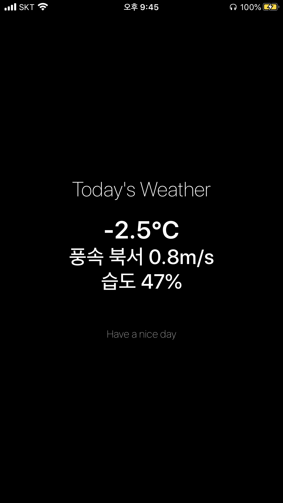

# SimpleWeather

Swift UI Test with Weather API




------

## Step1. Display data from naver.com (parsing)

using URL, Data, String.components()

```swift
import CoreFoundation

@State var temp : String = ""
@State var wind : String = ""
@State var humi : String = ""

func getBeside( str : String, from : String, to : String, index : Int = 0 ) -> String
{
  var tmp = str.components(separatedBy: from)[1+index]
  tmp = tmp.components(separatedBy: to)[0]
  return tmp
}

func loadWeather ( ) -> Void {
  do {
    let url = URL(string: "http://www.weather.go.kr/weather/forecast/timeseries.jsp")!
    let data = try Data(contentsOf: url)
    let html = String(data: data, encoding: String.Encoding(rawValue: CFStringConvertEncodingToNSStringEncoding( 0x0422 )))!
    let partial = getBeside(str: html, from: "<div class=\"local_forecast_inn\">", to: "_<>_<>_")
    temp = getBeside(str: partial, from: "<dd class=\"now_weather1_center temp1 MB10\">", to: "</dd>")
    wind = getBeside(str: partial, from: "<dd class=\"now_weather1_center\">", to: "</dd>")
    humi = getBeside(str: partial, from: "<dd class=\"now_weather1_center\">", to: "</dd>", index: 1)
  }
  catch
  {
    print("error")
  }
}
```


## Step2. Display data on widget

- Not yet